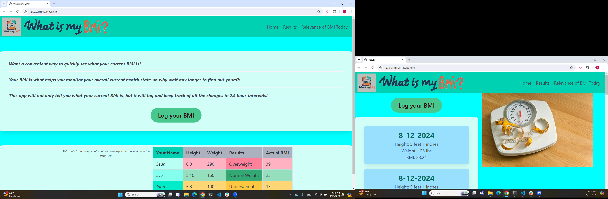

# What-is-my-BMI

## Description 
A tool to help measure your body mass index. 
This is achieved by the user submitting their height and weight into the prompt, which then gives them a rounded BMI.
For a more accurate result, the user can navigate to the daily logs, as this will show the BMI in decimal form.
The application also explains why the BMI is relevant today, and how it can be useful for any individual trying to achieve their goals.
We want users to feel comfortable at all times knowing where they stand on the BMI, and this is why they should feel at ease when using it.

## User Story

AS A weight watcher, 
I WANT to know what my BMI is
SO THAT I know if I am healthy or not.
I ALSO WANT to log my results once a day 
SO THAT I can keep track of where I stand.
ADDITIONALLY I NEED to read on why BMI is relevant today still.

## Acceptance Criteria 

PROVIDED a convenient application, 
WHEN I load the app, 
THEN I have the main page loaded to input my height and weight
WHEN I submit my data,
THEN I receive the results of my BMI.
WHEN I navigate to the 'Results' page,
THEN I see the daily logs of all my entries.
WHEN I try to enter a new log twice on the same day, 
THEN the page does not log it in multiple times.
WHEN I want to learn fun facts, and the relevance of of BMI today, 
THEN I tap on to the 'Relevance' tab to read about everything I want to know. 
WHEN I want to go back to the 'home' or 'results' page,
THEN I tap on any tab on the navigational bar.

## Installation 

The steps to download the application are as simple as downloading it from the user's app or play store.
Additionally, the user can use the web browser version which would only require them to enter the URL into the search bar.

## Usage

This is a quick and easy to use application by simply picking the feet and inches of the user by navigating through a drop down menu. 
For the weight portion, we ask the users to just type in what their weight is, and immediately after this, they will see the results of their BMI.
They can also refer to the 'Results' page to see a daily log of any changes they've had on their BMI, which is recommending for any user trying to make this part of a new lifestyle.

## Credits 
Bryan Spencer - https://github.com/Bryspen 
 
Patrick Bowman - https://github.com/Godzelduh
 
Caleb Parker - https://github.com/CJdacoda

## License 

MIT License

Copyright (c) 2024 Godzelduh

Permission is hereby granted, free of charge, to any person obtaining a copy
of this software and associated documentation files (the "Software"), to deal
in the Software without restriction, including without limitation the rights
to use, copy, modify, merge, publish, distribute, sublicense, and/or sell
copies of the Software, and to permit persons to whom the Software is
furnished to do so, subject to the following conditions:

The above copyright notice and this permission notice shall be included in all
copies or substantial portions of the Software.

THE SOFTWARE IS PROVIDED "AS IS", WITHOUT WARRANTY OF ANY KIND, EXPRESS OR
IMPLIED, INCLUDING BUT NOT LIMITED TO THE WARRANTIES OF MERCHANTABILITY,
FITNESS FOR A PARTICULAR PURPOSE AND NONINFRINGEMENT. IN NO EVENT SHALL THE
AUTHORS OR COPYRIGHT HOLDERS BE LIABLE FOR ANY CLAIM, DAMAGES OR OTHER
LIABILITY, WHETHER IN AN ACTION OF CONTRACT, TORT OR OTHERWISE, ARISING FROM,
OUT OF OR IN CONNECTION WITH THE SOFTWARE OR THE USE OR OTHER DEALINGS IN THE
SOFTWARE.